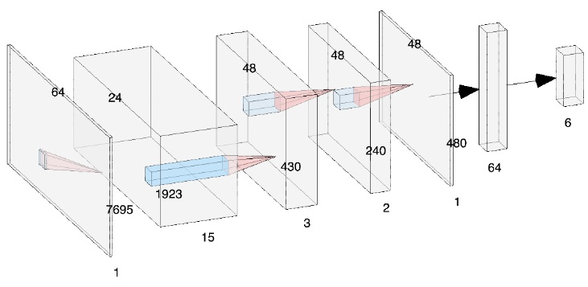
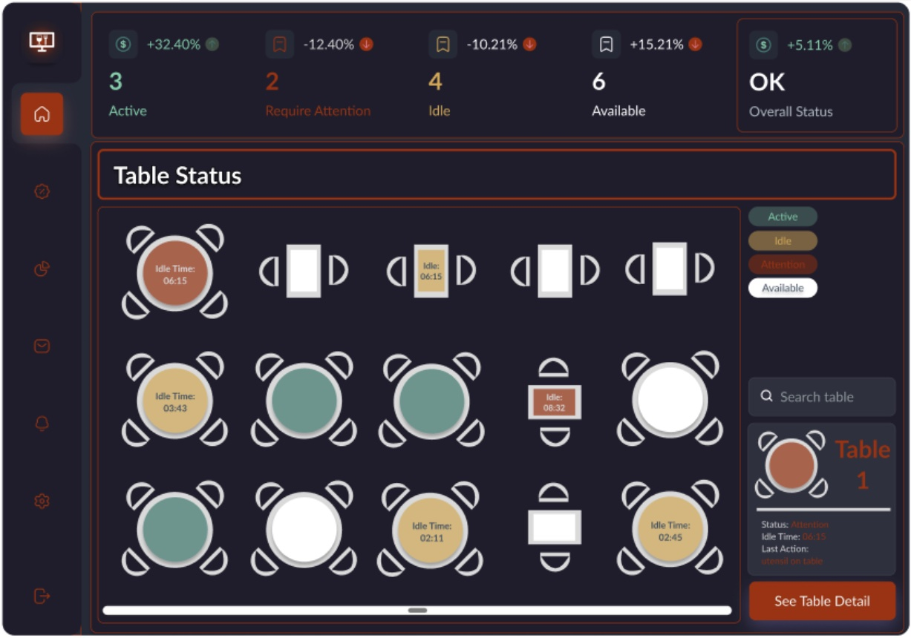
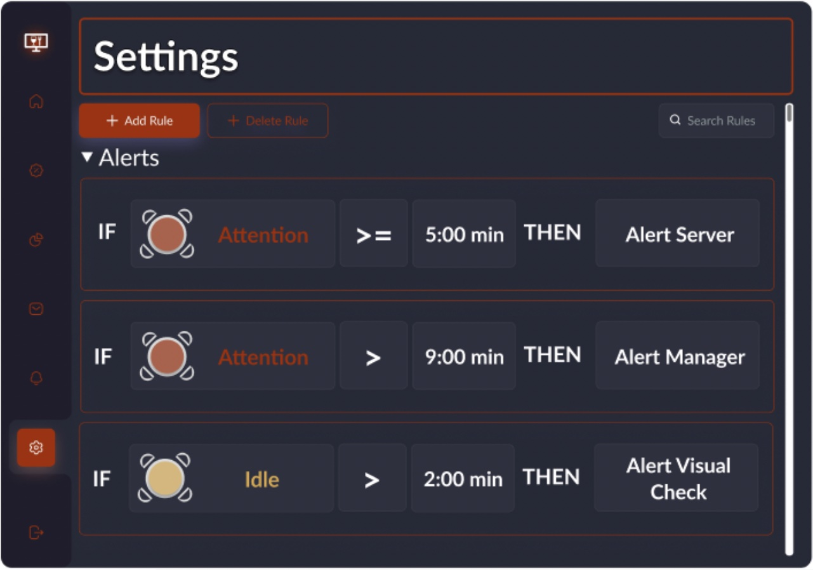

Learn how the core technologies behind Pronto work.
<!--more-->

Pronto utilizes a multitude of technologies which enable its cutting edge system.

## Embedded Platform

At the core of the Pronto Solution is the embedded system edge device. This deployed package contains a piezo-electric transducer to sense the vibrations that are happening directly on the dining service. This contact-only transduction isolates all other inputs and ensures we only capture the relevant information; each table is protected completely from each other guaranteeing reliable information that scales without any issue

## Datasets and collected information
Our model is built to detect the following types of events:

* Glassware placed on a table surface
* Plates placed onto on a table surface
* Utencils placed onto a table surface
* Utencils coming into contact with plates
* Idle activity

### Data Modelling: Artificial Data Creation
Due to the unique nature of our interface (the data signature from a piezo transducer is much different that a condensor or electet microphone), we populated our own core dataset capturing each labelled group manually. This meant simulating a dining scenario as a restaraunt would have at a place of our leisure and recording 100s of samples in succession. This efficiently created a scenario where we did not need to record data at restaraunts where collecting the data would have been both timely and costly.

## Predictive Modelling
Our trained predictive model relies on the following:

### Convolutional Neural Networks
Our predictive neural network uses a 6-layer convolutional neural network that is inspired by the architectures of VGG and SB-CNN. The visualization can be seen below.

### Data pipeline
To model our data before it enters our Convolutional Neural Network, we do the following modifications in a pipeline.

### Predictive Modelling: Inference Mode

To run inference mode, we create a queue system where we window 4 seconds of audio and send it to a queue with the relevant timestamp. That time-bucketed clip gets run through the pre-trained model to evaluate what the model believes the clip to be and it returns the predicted class and also the percentage of confidence that the model has for each class.

## User Interface
There are two main user interfaces that we provide with Pronto.

### Live View

In our Live View, we present a real-time instantaneous view of the restaraunt floorplan with our prediction estimates of the state of each individual table

### Rules Engine

Our rules engine serves as a way to get the core information from the model and delivering the infrormation exactly when the waitstaff need it most

