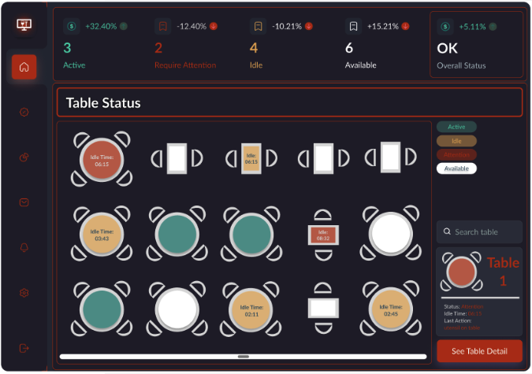
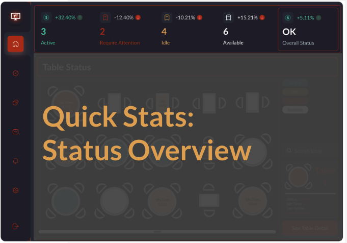
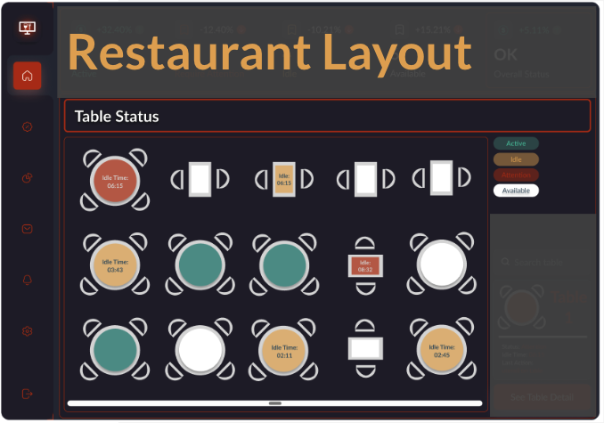
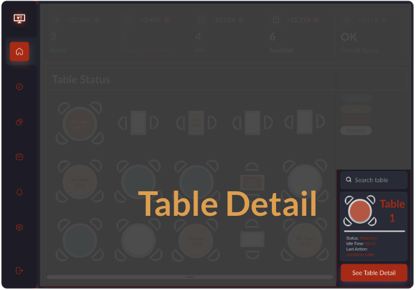
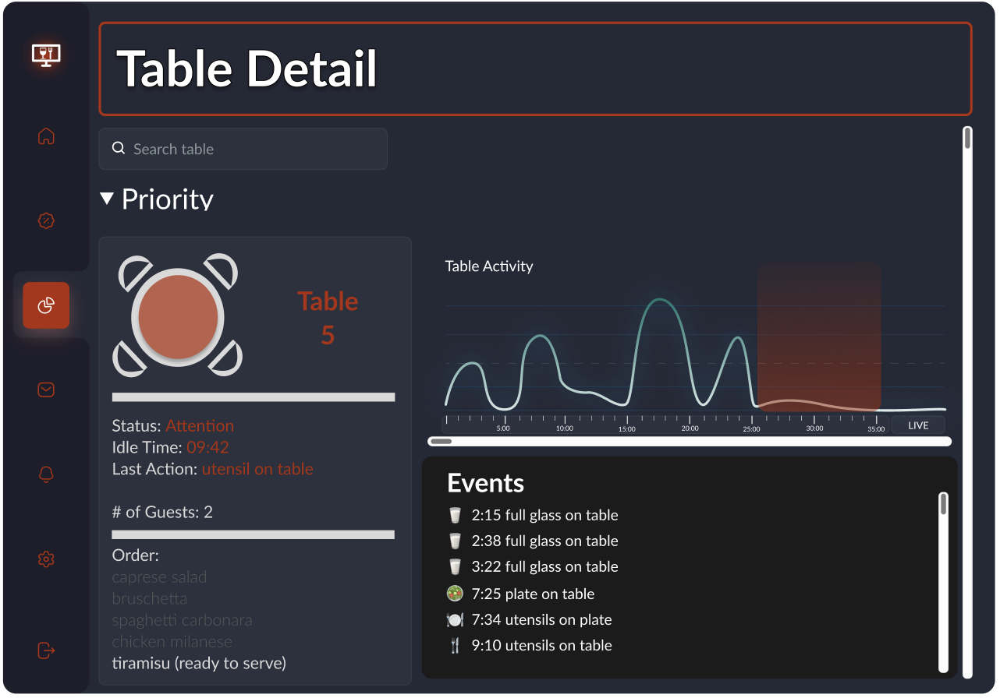
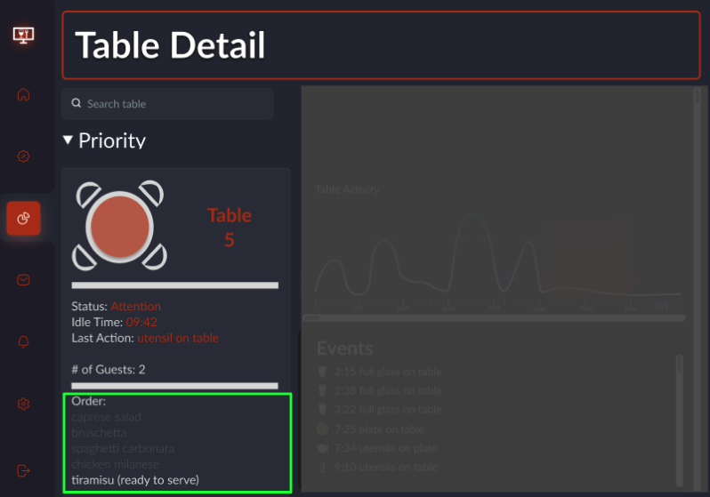
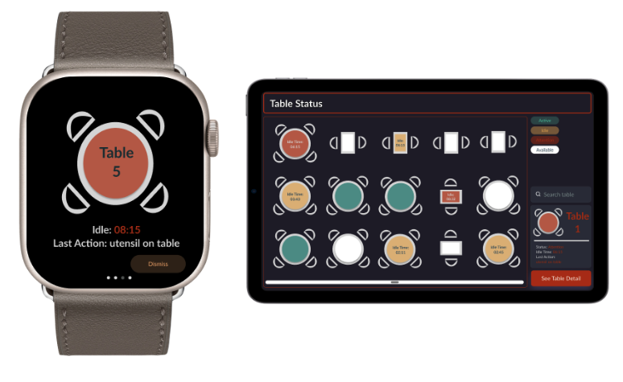

How Pronto brings the functionality you want and need, FAST!
<!--more-->

Pronto utilizes a multitude of technologies which enable its cutting edge system.

## Intuitive Design

At the heart of Pronto, we want a great user experience. We give you all the data you need but none of the clutter you don't. 

## Homepage

The homepage is your birdseye view of the restaurant. This is the one stop shop to understanding your service levels throughout the restaurant. Next we'll dive into each one of the sections and built in funcationality in more detail.

## Status Overview

This is the overview of tables and status (customized to your restaurant in our "settings"/"rules engine). This functionality gives a quick summary of the volumne of tables to may need service.

## Restaurant Layout

Now that you have a lay of the land from the Status Overview, the fully customizable restaurant layout quickly helps you define and spot (within your restaurant space) which tables may need service. The duration of idle time and status is displayed readily in the UI to prioritize to provide service.

## Table Detail

Search and zoom into any table. Quickly view the most relevant stats right on the homepage. Click the button to take you to a more detailed view...

The graph to show table activity levels. This view provides a record of the event details throughout the duration of the meal to help identify which phase and which actions/service may be needed next.

Pronto makes its easy to work popular point of sale systems (optional). By displaying relevant order details, servers and managers can anticipate action and serice needed for the customer.

## Mobile Friendly

And as always Pronto is solution that moves with you. The UI is designed for a suite of mobile devices (iPhone, iPad, Apple Watch, Android Tablets) to work with the dynamic nature of restaurant management.

